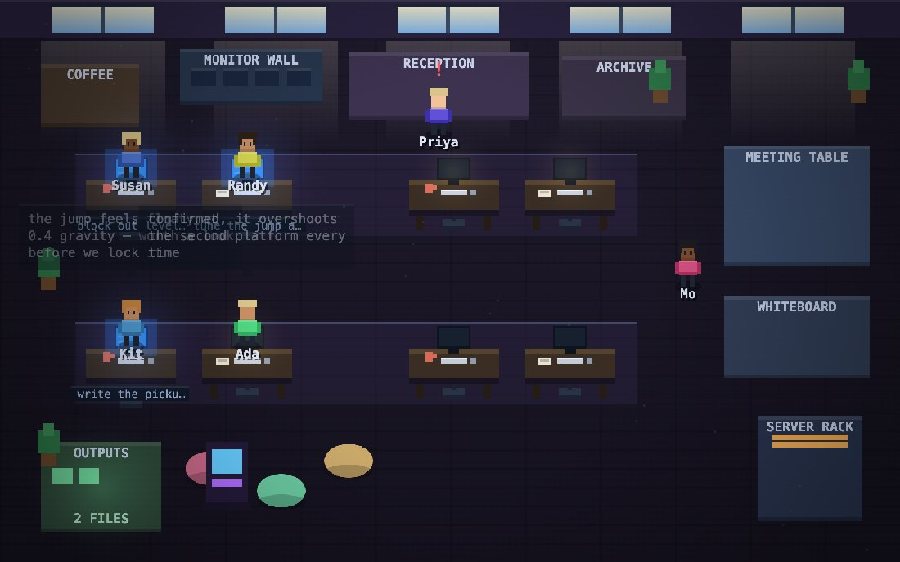

<div align="center">

# GlassBox

**A reasoning and relay studio that runs entirely in your browser.**

One HTML file. No build step. No account. No server holding your keys.

[Open it →](https://glassbox.vercel.app) · [Download for macOS](desktop/GlassBox-macOS.dmg) · [Download for Windows](desktop/GlassBox-Windows.zip)

</div>

---

## Your keys never leave your machine

This is the part worth reading before anything else.

GlassBox has **no backend**. There is no account system, no database, no telemetry, and no
server that ever sees your API keys, your prompts, or your outputs.

- **API keys** are stored in your browser's `localStorage`, on your device, and are sent
  **only** to the provider you configured them for — straight from your browser to
  Anthropic, OpenAI, or whoever, with nothing in between.
- **Prompts, responses, traces, notes and files** are stored the same way. Nothing is
  uploaded anywhere.
- **The hosted copy is static.** Vercel serves one HTML file and never sees a request after
  that. It cannot read your `localStorage` — no server can.
- **The downloaded copy runs from your own RAM.** Nothing is hosted at all; the page is
  served by a local process on `127.0.0.1` that only your machine can reach.

Because there is no cloud sync, there is also no safety net: **clear your browser data and
it is gone.** Settings → *Export Full Backup* writes a JSON file you own. Take one.

---

## The three things worth opening first

### 🏢 Virtual Office

Your agents, as a room you can watch. This is not decoration — every character, walk,
speech bubble and alert is driven by real state. A character typing at a desk means that
bot really holds that task. Two characters talking means that message really was sent. A
red mark over someone's head means something destructive is genuinely waiting for your
approval. **When the swarm is idle, the room is idle** — that honesty is the feature.



Six office themes that change the layout, not just the palette — a startup loft with bean
bags and a slide, a game studio with pods and an arcade, a trading floor with dense rows
and a live ticker, cubicles, an agency, a lab. One dial takes the team from strictly
factual to full banter, and it rewrites the prompt rather than filtering the output.

### 🧊 3D Editor

A real three.js editor, built to the same shape as the official one: menubar, outliner,
properties inspector, transform gizmos, and a command stack where **every change is
undoable**. 16 primitives, 5 light types, 2 camera types, drag-and-drop placement that
lands where you point, drag-to-reparent in the outliner, and glTF / JSON / standalone-HTML
export. Drop a `.glb` onto the viewport and it loads.

The scene runs in a sandboxed iframe, so a shader that fails to compile cannot take the
rest of the app down with it.

### 🌳 Reasoning traces

Every model call becomes a span with a parent, so a run reads as a **tree rather than a
flat log** — and the shape is the diagnostic. A healthy run is broad and shallow; a run
that has gone wrong is one branch descending forever, or the same node repeating.

On top of that sit local heuristics that cost nothing to run: circular reasoning (a later
step restating an earlier one), steps that spent tokens and returned nothing, a model that
thought itself out of an answer, sudden context loss, runaway depth, error cascades. Each
one reports *why*, because an unexplained warning is noise.

---

## Everything else

**Models and providers** — any model id on any OpenAI-compatible provider, live `/models`
sync, and a hand-typed escape hatch that survives every refresh · Ollama, LM Studio and
Unsloth Desktop · cross-provider reasoning-trace capture and transplant · Ultrathink for
models that expose a large thinking budget · fallback routing when a local model dies
mid-thought.

**Agents** — a bot roster that collaborates by *messaging each other*, with every handoff
recorded · a task board with artifact locks, so two bots can never overwrite each other's
work · a destructive-action gate that holds `rm -rf`, force-pushes and anything touching
money or real people until you approve it · a reasoning-model manager that plans and
delegates but never builds · Slack-style calls with browser text-to-speech.

**Documents and knowledge** — on-device OCR (PaddleOCR or Tesseract) that reads scanned
PDFs with no upload and no per-page cost · a brain that imports from Granular, Obsidian,
Logseq, Notion or any folder of markdown · real `.docx` / `.xlsx` / `.pptx` generation in
the browser · GitHub repo reverse-engineering.

**Measurement** — cost per *completed* task, not per token · prompt-cache-stable message
ordering · semantic response caching · golden traces you can regress against · A/B harness
experiments · a device lab that sweeps the UI at real viewport sizes.

**And** — MCP connectors over HTTP and stdio · OpenBot integration · web search with
domain filters · a long-horizon mode where only the harness may mark work done · office
document generation · scheduled monitors that tell you what *meaningfully* changed on a
page.

---

## Running it

### In the browser

Open **[glassbox.vercel.app](https://glassbox.vercel.app)**. Add a provider key in Settings
and you are working. Nothing installs.

### On your machine

| | |
|---|---|
| **macOS** | [`GlassBox-macOS.dmg`](desktop/GlassBox-macOS.dmg) — drag `GlassBox.app` to Applications. |
| **Windows** | [`GlassBox-Windows.zip`](desktop/GlassBox-Windows.zip) — unzip, run `GlassBox-Launch.bat`. |
| **Anything** | Download [`GlassBox.html`](GlassBox.html) and open it. One file. |

> **macOS first launch:** the app is not code-signed, so Gatekeeper will refuse it once.
> Right-click `GlassBox.app` → **Open** → **Open**. You only do this one time.

> **Windows** needs Python 3 on PATH (tick *Add python.exe to PATH* in the installer). The
> launcher only uses it to serve the folder locally.

### Why a local server instead of just opening the file

Opened directly, the page's origin is `null`, and **Ollama and LM Studio both refuse a null
origin**, so local models never connect. Both launchers serve the folder on `127.0.0.1` and
walk to the next port if one is busy — they check that a port is actually serving GlassBox
before reusing it, rather than assuming.

---

## Local models

### Ollama

```bash
ollama serve
ollama pull qwen3.8:27b
```

Then press **Connect Ollama** in Settings. GlassBox probes `127.0.0.1`, `localhost` and
`[::1]` together and keeps whichever answers — macOS often runs two Ollama servers at once
(the desktop app on IPv6, a terminal `ollama serve` on IPv4), and `localhost` resolves to
IPv6 first, so a terminal-set `OLLAMA_ORIGINS` is frequently never reached.

If you opened the HTML directly rather than through a launcher:

```bash
OLLAMA_ORIGINS='*' ollama serve
```

### LM Studio

Start its local server (default `http://localhost:1234`), then add it in Settings as an
OpenAI-compatible provider. Its `/v1/models` endpoint populates the model list.

### Unsloth Desktop

Serves models behind an authenticated local API and speaks **two dialects on one port** —
OpenAI's `/v1/chat/completions` and Anthropic's `/v1/messages`. Create a key in Unsloth
(avatar → Settings → API), paste it into the **Local** tab, and press Probe. It walks
`:8000 :8888 :1234 :11435 :8080` and reports which one answered.

### The bridge — optional

```bash
node glassbox-bridge.mjs
```

A single-file Node companion, no dependencies. You only need it for things a browser
genuinely cannot do:

- run **local MCP servers** — a browser cannot spawn a process, ever
- drive installed CLI agents (Claude Code, Codex, and others it detects)
- fetch URLs that refuse cross-origin requests
- write handoff files to a folder you choose

It generates a random token at startup, hands it to the first tab that asks, and the token
dies with the process. Nothing persists.

---

## Building on it

`glassbox.d.ts` types the automation surface. The app exposes ~1,100 functions and state
values on `window.__gb`, which is how its own test suite drives it:

```js
/// <reference path="./glassbox.d.ts" />
const span = window.__gb.spanStart('my-call', 'llm', { model: 'x' });
window.__gb.spanEnd(span, acc);
console.log(window.__gb.checkReasoning().flags);
```

---

## Licence

MIT. See [LICENSE](LICENSE).
